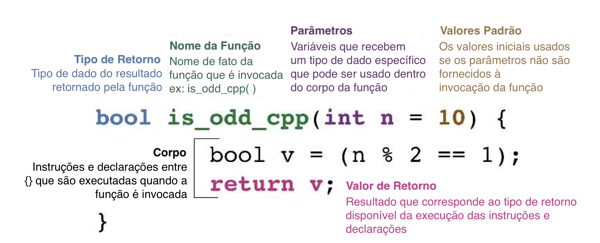

```{r setup, include=FALSE}
knitr::opts_chunk$set(echo = TRUE,
                      fig.align = "center")
```

<!--Academicons Icons-->
<link rel="stylesheet" href="https://cdn.jsdelivr.net/gh/jpswalsh/academicons@1/css/academicons.min.css">

## Linguagems Dinâmicas vs Estáticas^[Julia é um caso a parte pois pode ser tanto codificada de maneira estática quando dinâmica, mas isso é assunto para outro tutorial.]

Geralmente as linguaguens de programação são categorizadas entre linguagens dinamicamente tipadas ou estaticamente tipadas.

O **R é uma liguagem dinamicamente tipada**. Isso quer dizer que os tipos das variáveis e dados **não são declarados no código** e, portanto, conhecidos/checados somente em tempo de execução. Além do R, Ruby, Python e Clojure também são exemplos de linguagens dinamicamente tipadas. A principal vantagem de uma linguagem dinamicamente tipada é a sua **agilidade**: você se torna mais produtivo e o código mais enxuto, mas isto vem com um custo. A principal desvantagem é que linguagems dinamicamente tipadas são **bem mais lentas** em tempo de execução.

O **C++ é uma linguagem estaticamente tipada**. Isso quer dizer que os tipos das variáveis e dos dados **são explicitamente definidos no código** e, portanto, conhecidos/checados em tempo de compilação. Além de C++, Java, C#, F#, Kotlin e Go são exemplos de linguagens estaticamente tipadas. A principal vantagem de uma linguagem estaticamente tipada é a sua **velocidade em tempo de execução**. Sua principal desvantagem é a **rigidez**: você se torna menos produtivo e o código muito mais verboso.

## O quão lento R é comparado à C++?

Não conseguimos definir um índice preciso de comparação de tempo de execução entre R, C++ ou qualquer outra linguagem de programação. Isto varia muito conforme aplicação, sistema operacional e tamanho dos dados.

### Exemplo - Simples Função de Soma

Como primeiro exemplo, imagine uma função que soma três números inteiros e retorna o valor da soma. Vamos chamar essa função de `add()` e compararemos o tempo de execução dessa função em R `addR()` e em C++ `addCpp()`:

```{r addR}
addR <- function(x, y, z) {
    result <- x + y + z
    return(result)
}

addR(10, 17, 31)
```

```{r addCpp, warning=FALSE}
library("Rcpp")
cppFunction("
int addCpp(int x, int y, int z){
   int result = x + y + z;
   return result;
}")

addCpp(10, 17, 31)
```

Comparando tempo de execução com a função `mark()` do pacote `{bench}`:

```{r bench-add, message=FALSE}
b1 <- bench::mark(
  R   = addR(10, 17, 31),
  Cpp = addCpp(10, 17, 31),
  relative = TRUE
)
b1
```

```{r fig-bench-add, echo=FALSE, fig.cap='Benchmark da função soma: R vs C++'}
ggplot2::autoplot(b1, "violin")
```

Aqui vocês vem que C++ não tem nenhuma vantagem sobre R: é mais verboso, chato de escrever e ainda é mais lenta!

### Exemplo - Amostrador de Gibbs

Como segundo exemplo vamos fazer algo mais computacionalmente intensivo. Para quem não conhece, [Amostrador de Gibbs (*Gibss Sampler*)](https://en.wikipedia.org/wiki/Gibbs_sampling) é um algoritmo de aproximação de uma distribuição probabilística multivariada que usa Método de Montecarlo com correntes Markov; e é primariamente utilizado em casos quando amostragem direta não é possível. Este exemplo foi retirado do [blog do Dirk Eddelbuettel](http://dirk.eddelbuettel.com/blog/2011/07/14/) mantenedor do ecossitema `{Rcpp}` de pacotes de interfaces entre R e C++.

O código em R é assim:

```{r gibbsR}
gibbsR <- function(N, thin) {
  mat <- matrix(nrow = N, ncol = 2)
  x <- y <- 0

  for (i in 1:N) {
    for (j in 1:thin) {
      x <- rgamma(1, 3, y * y + 4)
      y <- rnorm(1, 1 / (x + 1), 1 / sqrt(2 * (x + 1)))
    }
    mat[i, ] <- c(x, y)
  }
  return(mat)
}
```

Agora o código em C++ (não se preocupe agora com os `Rcpp` que aparecem no código, isto será explicado na [segunda parte desse tutorial](2-Rcpp.html)):

```{r gibbsCpp, warning=FALSE}
sourceCpp(code = 
"#include <Rcpp.h>
using namespace Rcpp;

// [[Rcpp::export]]
NumericMatrix gibbsCpp(int N, int thin) {
  NumericMatrix mat(N, 2);
  double x = 0, y = 0;

  for(int i = 0; i < N; i++) {
    for(int j = 0; j < thin; j++) {
      x = rgamma(1, 3, 1 / (y * y + 4))[0];
      y = rnorm(1, 1 / (x + 1), 1 / sqrt(2 * (x + 1)))[0];
    }
    mat(i, 0) = x;
    mat(i, 1) = y;
  }

  return(mat);
}"
)
```

E vamos para o benchmark comparando alguns tamanhos de inputs:

```{r bench-gibbs, message=FALSE}
b2 <- bench::press(
  N = 10^c(2:3),
{
  bench::mark(
    R = gibbsR(N, 10),
    Cpp = gibbsCpp(N, 10),
    check = FALSE,
    relative = TRUE
  )
}
)
b2
```

```{r fig-bench-gibbs, echo=FALSE, fig.cap='Benchmarks do Amostrador de Gibbs: R vs C++'}
ggplot2::autoplot(b2, "violin")
```

No meu computador `gibbsCpp()` executa 20x mais rápido que `gibbsR()`!

## Sobrevoo de C++

**O foco aqui _não_ é ensinar C++**. Para isso recomendo você encontrar materiais e cursos que se conformem com o seu estilo de aprendizagem. Eu aprendi com um misto de quatro coisas:

1. **Livros**:
   * [A Tour of C++](https://stroustrup.com/Tour.html): livro de 2018 do criador de C++, Bjarne Stroustrup. É bem conciso e recomendado para quem conhece alguma linguagem de programação orientada a objetos (ex: Python, Java, ...).
   * [C++ Primer](https://computingsavvy.com/books/c-primer-fifth-edition/): uma das principais referências de C++. Está na quinta edição de 2011. É interessante para aprender o básico de C++ junto com uma introdução à biblioteca padrão (*Standard Template Library* -- STL). Como C++ lança uma nova edição a cada 3 anos, esse livro não possui todas as novas funcionalidades de C++14, C++17 e C++20.
  
2. **Referências**:
   * [cppreference.com](https://en.cppreference.com): aqui está a bíblia de C++ totalmente atualizada. Para tudo o que você precisar vale a pena consultar aqui, mas ela é bem técnica. Necessário um certo nível de conhecimento básico em C++ para compreender.
   * [geeksforgeeks.com](https://www.geeksforgeeks.org/c-plus-plus/): Geeks for Geeks é um site da Índia sobre programação com uma abordagem mais descontraída. A referência de C++ é bem mais "leve" que a cppreference. Vale a pena para ajudar a entender conceitos que você não tenha entendido pois tem exemplos interessantes.
3. **Vídeos no YouTube**:
   * [CppCon](https://www.youtube.com/user/CppCon): a principal conferência anual sobre C++, todos os vídeos das sessões da conferência são disponibilizados gratuitamente no YouTube.
   * [CppNow](https://www.youtube.com/user/BoostCon): outra conferência anual sobre C++ com uma pegada mais descontraída e participação da platéia. O vídeo do Conor Hoekstra^[um dos hosts do podcast ADSP.] sobre [*Algorithm Intution*](https://youtu.be/48gV1SNm3WA) é fenomenal.
   * [Meeting Cpp](https://www.youtube.com/user/MeetingCPP): outra conferência anual sobre C++, possui bons vídeos com uma pegada similar a CppNow. 
   * [The Cherno](https://www.youtube.com/user/TheChernoProject): Um ex-programador de jogos da EA. Ele tem uma didática excelente e eu recomendo a playlist [C++](https://www.youtube.com/playlist?list=PLlrATfBNZ98dudnM48yfGUldqGD0S4FFb) do seu canal.
4. **Podcasts**:
   * [CppCast](https://cppcast.com): podcast de entrevista com desenvolvedores e pessoas de destaque da comunidade C++. Sempre iniciam os episódios comentando com o entrevistado as últimas notícias do mundo C++ e programação em geral.
   * [cpp.chat](https://cpp.chat): similar ao CppCast.
   * [ADSP](https://adspthepodcast.com): este é um podcast novo e promissor. Seu nome ADSP significa *Algorithms + Data Structures = Programs*^[Algoritmos + Estruturas de Dados = Programas.] e um dos hosts é o Conor Hoekstra programador da NVIDIA e o palestrante do vídeo [*Algorithm Intution*](https://youtu.be/48gV1SNm3WA). 

### História do C++

A linguagem C++ é uma linguagem de programação orientada a objetos e é uma combinação de linguagem de baixo e alto nível -- uma linguagem de nível médio. A linguagem de programação foi criada, projetada e desenvolvida por um cientista da computação dinamarquês -- Bjarne Stroustrup da Bell Telephone Laboratories (agora conhecida como Nokia Bell Labs) em Murray Hill, New Jersey. Como ele queria uma linguagem flexível e dinâmica que fosse semelhante a C com todos os seus recursos, mas com adicionalidade de verificação de tipo ativa, herança básica, argumento de funcionamento padrão, classes, inlining, etc. e, portanto, C com Classes (C++) foi lançado .

```{r bjarne, echo=FALSE, fig.cap='Bjarne Stroustrup. Figura de: www.wikipedia.org', out.extra='class=external'}

```


C++ era inicialmente conhecido como “C com classes” e foi renomeado C ++ em 1983. ++ é uma abreviação para adicionar um à variedade na programação; portanto, C++ significa aproximadamente que "um maior que C." Em 1998, foi criado o comitê de padrões C++ que publicou o primeiro padrão internacional ISO para C++, que seria informalmente conhecido como C++98. A cada três anos o comitê de padrões de C++ publica um novo padrão internacional e esses adquirem o sufixo do ano. Até agora temos C++11, C++14, C++17, C++20 e propostas para serem incluídas no C++23.

O padrão C++11 é importante, tanto que foi seu nome oficial é "o novo padrão C++". A principal inovação é a biblioteca padrão de C++ (*Standard Template Library* -- STL) que traz quatro componentes chamados algoritmos (*algorithms*), contêineres (*containers*), funções (*functions*) e iteradores (*iterators*). Os componentes, além de serem revolucionários (C++ pode ser considerado uma linguagem totalmente diferente depois do STL de C++11), são extremamente bem mantidos e documentados. A presença de bugs é quase nula fazendo com que todos os componentes sejam confiáveis e sempre funcionem da maneira que eles foram supostamente projetados para funcionar (a sonda da NASA em Marte possui seu software todo em C++).

### Tipos de Variáveis -- R vs C++

Os principais tipos de variáveis de R e sua correspondência em C++ na tabela abaixo. Note que os nomes são bem similares.

```{r table_R_Cpp, echo=FALSE}
library(gt)
library(dplyr)
tibble::tribble(
      ~Value,   ~R,                     ~Rcpp_vector,                     ~Rcpp_matrix, ~Rcpp_scalar, ~`C++`,
   "Logical",   "logical",                  "LogicalVector",                  "LogicalMatrix",          "-",        "bool",
   "Integer",   "integer",                  "IntegerVector",                  "IntegerMatrix",          "-",         "int",
      "Real",   "numeric",                  "NumericVector",                  "NumericMatrix",          "-",      "double",
   "Complex",   "complex",                  "ComplexVector",                  "ComplexMatrix",   "Rcomplex",     "complex",
    "String", "character", "CharacterVector (StringVector)", "CharacterMatrix (StringMatrix)",     "String",      "string",
      "Date",      "Date",                     "DateVector",                              "-",       "Date",           "-",
  "Datetime",   "POSIXct",                 "DatetimeVector",                              "-",   "Datetime",      "time_t"
  ) %>%
  select(R, `C++`) %>%
  filter(!(R %in% c("Date", "POSIXct"))) %>% 
  mutate_all(~stringr::str_glue("`{.}`")) %>% 
  gt() %>% 
  fmt_markdown(everything())
```

Além disso, toda linha (instruções e declarações) de C++ deve ser encerrada com um ponto-e-vírgula `;`.

### O qualificador -- `const`

C++ tem diversos tipos de modificadores e qualificadores de variáveis (ex: `long`, `unsigned`, `volatile`, `static`, etc.). Não vou cobrir todos eles, mas apenas um: `const`.

`const` significa constante (*constant*) e é um qualificador usado quando você declara explicitamente que a variável não mudará o seu valor (por mais paradoxal que isso soe...) durante toda a execução do código. Por exemplo se eu tenho um `int` chamado `n_execucao` que não mudará o seu valor:

```cpp
const int n_execucao = 10;
```

### Referências -- `&`

Cada variável que é criada em C++ (e na maioria das outras linguagems de programação) possui um endereço de memória que indica aonde a variável está localizada fisicamente na memória do computador. Esse endereço é como se fosse um código postal indicando aonde conseguimos encontrar a variável. Para criar uma referência usamos o símbolo `&`. Isto cria uma variável que é uma referência à outra variável e o valor de uma variável referência é o endereço da variável da qual ela referencia. Veja alguns exemplos (obs: `//` é como comentamos código em C++, equivalente ao `#` em R):

```cpp
int i = 5;  // variável int
int& j = i; // variável j que é uma referência a i
&i;         // endereço de memória da variável int i
i++;        // incrementar i em 1
i == j;     // TRUE
j == 5;     // FALSE j agora possui o mesmo valor que i (6)
```

Por que usar referências? Por dois motivos:

1. Para **evitar a cópia de objetos na memória**: isso faz o código ficar mais **eficiente**.
2. Paramêtros de funções podem especificados por valor ou por referências. No caso de referências,  isso é extremamente útil quando queremos **alterar os valores dos parâmetros *in-place* pela função**.


### Funcões em C++ 

A figura \@ref(fig:cppfunction) mostra a anatomia de uma função em C++. Ela é bem similar à estrutura de funções no R. Com duas notórias diferenças:

* **Tipo de Retorno**: toda função em C++ deve especificar, antes do seu nome, o tipo de dado que é retornado pela função.
* **Valor de Retorno**: toda função em C++ deve especificar explicitamente qual valor retornar com um `return`. No R podemos ser mais desleixados pois o valor de retorno será sempre a ultima declaração da função. Em C++ isto não funciona. A lógica de C++ é que a função termina quando ela atinge o primeiro `return` e retorna o dado/variável especificado(a). 

```{r cppfunction, echo=FALSE, fig.cap='Anatomia de uma função em C++. Figura adaptada da Vinheta Oficial Introdutória do `{Rcpp}` de Dirk Eddelbuettel'}

```

#### Usando valores vs referências como parâmetros

Às vezes é mais eficiente especificar um parâmetro como uma referência do que como um valor. Veja o caso abaixo de uma função simples de incremento de número inteiro. No primeiro caso, a função `increment_val()` usa o valor do parâmetro `x`. Isto implica na função gerar uma cópia de `x` no escopo local da função. Já no segundo caso, a função `increment_ref()` usa a referência do parâmetro `x`. Isto não implica em cópia de `x`, pois a função manipula o parâmetro `x` no escopo global.

Como podem ver, nesse cenário simples temos um pequeno ganho, pelo tempo mediano de execução, ao usarmos o a referência como parâmetro. Claro que nesse exemplo a função é trivial, imaginem como essa diferença escalonaria para maior intensidade computacional ou maior entrada de dados. Sem contar que precisamos de ZERO coletor de lixo (*garbage collection* -- `gc`), pois não estamos movendo/copiando nada para o escopo local da função.

```{r increment_cpp, warning=FALSE}
cppFunction(
"int increment_val(int x){ 
    x++;
    return x;
}"
)

cppFunction(
"int increment_ref(int& x){ 
    x++;
    return x;
}"
)

bench::mark(
  value = increment_val(5),
  reference = increment_ref(5)
)
```

## Loops `for` em C++

> Obs: Em C++ todos os índices são baseados em zero. Ou seja, o primeiro elemento de uma `array` é `array[0]`.

Os loops `for` de C++ são similares ao de R. Eles seguem a seguinte síntaxe:

```cpp
for (inicialização; condição; incremento) instrução;
```

Funciona da seguinte maneira:

1. A `inicialização` é executada. Geralmente, isso declara uma variável de contador (*counter*) e a define para algum valor inicial. Isso é executado uma única vez, no início do loop.
2. `condição` é verificada. Se for verdade, o loop continua; caso contrário, o loop termina e a `instrução` é ignorada, indo diretamente para a etapa 5.
3. `instrução` é executada. Como de costume, pode ser uma única instrução ou um bloco entre chaves `{}`.
4. `incremento` é executado e o loop volta para a etapa 2.
5. o loop termina: a execução continua na próxima instrução após ela.

Veja um exemplo^[aqui estamos usando o `cout` do `<iostream>`. Explicarei como printar mensagens no R usando C++ na [segunda parte desse tutorial](2-Rcpp.html)]:

```cpp
for (int i=0; i < 5; i++) {
      cout << i << "\n";
    }
```

C++11 introduziu uma funcionalidade chamada de *range-`for` loop* para ser usado com principalmente com os contêineres da C++11 STL, simplificando muito mais a síntaxe:

```cpp
for (declaração : expressão)
	instrução
```

* `declaração` - define uma variável. Deve ser possível converter cada elemento da sequência para o tipo da variável. A maneira mais fácil de garantir que os tipos correspondam é usar o especificador de tipo `auto`.
* `expressão` - deve representar uma sequência, como uma lista de inicializadores entre chaves, um `array` ou um objeto como um` vector` ou `string` que tem membros `begin` e `end` que retornam iteradores.

Exemplo:

```cpp
vector<int> a {1, 2, 3, 4, 5};

for (auto i: a) {
  cout << i << endl;
}
```

Compare com o `for` loop tradicional (muito mais verboso):

```cpp
vector<int> a {1, 2, 3, 4, 5};

for(int i=0; i < a.size(); i++){
   cout << a[i] << endl;
}
```

## Loops `while` em C++

Loops `while` em C++ são quase que idênticos aos do R. Veja um exemplo:

```cpp
int i = 0;

while (i < 10){
	i++;
	cout << i << "\n";
}
```

## Desvios condicionais `if`, `else if` e `else` em C++

Desvios condicionais em C++ são também quase que idênticos aos do R. Veja um exemplo:

```cpp
int i = 2;

if (i > 2) {
	cout << i << " é maior que 2\n";
} else if (i == 2){
	cout << i << " é extamente igual a 2\n";
} else {
	cout << i << " é menor que 2\n";
}
```

## Casos condicionais `switch`

Os casos condicionais usando o operador `switch` em C++ é também muito similar ao R. A única diferença é que ao invés de `=` temos `:` para especificar os casos, veja a síntaxe:

```cpp
switch(i) {
  case 1 : cout << '1';           // imprime "1"
  case 2 : cout << '2';           // imprime "2"
  default : cout << "default\n";	// imprime "default"
}
```

## Quando usar C++ no seu código R?

Os gargalos típicos que C++ pode resolver incluem:

* Loops que não podem ser facilmente vetorizados porque as iterações subsequentes dependem das anteriores.
* Funções recursivas ou problemas que envolvem a chamada de funções milhões de vezes. A sobrecarga de chamar uma função em C++ é muito menor do que em R.
* Problemas que exigem estruturas de dados (contêineres) e algoritmos avançados que R não fornece. Por meio da biblioteca padrão (STL), C++ tem implementações eficientes de muitas estruturas de dados importantes, de mapas ordenados (*ordered maps*) a filas duplas (*double-ended queues*).

Esses contextos são todos os cenários que C++ pode ajudar o seu código. "Nem mesmo os mais sábios sabem o fim de todos os caminhos"^[um dos meus objetivos era incluir no mínimo uma referência de Star Wars (já feita no Home) e uma de Senhor dos Anéis].

```{r gandalf, echo=FALSE}

```

## O que mais existe em C++?

Nesse breve sobrevoo de C++ a intenção é apenas possibilitar alguém que não tenha nenhum conhecimento em C++ à ser introduzido em alguns conceitos de C++, notoriamente focando em **funções** (eu acredito ser a principal razão de usarmos C++ em R -- acelerar o tempo de execução de funcões). Usando uma analogia, esse sobrevoo permite o leitor "dirigir C++ por um estacionamento vazio". Caso se interesse, C++ é uma linguagem EXTREMAMENTE rica e complexa. Veja os livros, referências, vídeos e podcasts que eu recomendei lá em cima.

## Ambiente

```{r SessionInfo}
sessionInfo()
```
