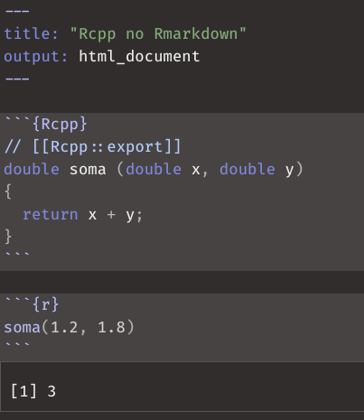

```{r setup, include=FALSE}
knitr::opts_chunk$set(echo = TRUE,
                      fig.align = "center")
```

<!--Academicons Icons-->
<link rel="stylesheet" href="https://cdn.jsdelivr.net/gh/jpswalsh/academicons@1/css/academicons.min.css">

A maneira mais fácil e simples de usar código C++ no R é pelo pacote `{Rccp}`. O primeiro passo é importar o pacote:

```{r Rcpp}
library(Rcpp)
```

## Criando funções em C++ no R

No `{Rcpp}` é possível criarmos funções de duas maneiras^[tem também o `evalCpp()` mas não vou cobrir aqui], sendo que ambas retornam as funções criadas em C++ para o ambiente do R:

1. `sourceCpp()`: lê código C++ de um arquivo `.cpp` ou de uma `string`.
2. `cppFunction()`: cria uma função C++ de uma `string`.

### `sourceCpp()`

Todo código C++ que é utilizado pelo `{Rcpp}` deve começar com duas instruções no arquivo (ou `string` do código):

```cpp
#include <Rcpp.h>
using namespace Rcpp;
```

* `#include <Rcpp.h>` -- indica que deve ser incluído o cabeçalho (*header*) do `{Rcpp}` no arquivo. Isto permite com que o código faça a interface com o R usando o `{Rcpp}`.
* `using namespace Rcpp;` -- importa todos os nomes que estão incluídos dentro da biblioteca `{Rcpp}`. Para os que ~~tem TOC~~ gostam de boas práticas, não é recomendável importar todos nomes de uma `namespace` em C++. Isto evita conflitos de nome. Caso queira usar algo de uma `namespace` você pode fazer de duas maneiras:
   1. Não importando a `namespace` e acessar o nome desejado da `namespace` com os quatro pontos (`::`). Exemplo:
   ```cpp
   Rcpp::List // toda vez que usar List tem que indicar que é o List do Rcpp.
   ```
   2. Importando apenas o nome desejado da namespace com o `using`. Exemplo:
   ```cpp
   using Rcpp::List;
   List  // toda vez que você digitar List C++ entende que é o List do Rcpp.
   ```

Além disso, para cada função que for criada no código C++ é necessário incluir o `// [[Rcpp::export]]` logo acima da função. Isto é necessário pois indica ao `{Rcpp}` que a função deve ser exportada de volta para uso no ambiente do R. No exemplo abaixo criei uma função `addCpp()` logo depois do `Rcpp::export`:

```cpp
// [[Rcpp::export]]
int addCpp(int x, int y, int z){
   int result = x + y + z;
   return result;
}
```

Há duas maneiras de usar `sourceCpp()`: fornecendo um arquivo `.cpp` ou um código C++ como `string`.

#### `sourceCpp()` -- Usando um arquivo `.cpp`

Criei um arquivo chamado `addCpp.cpp` com o código C++ pronto para ser usado pelo `{Rcpp}` com o `sourceCpp()`. Note que inclui um bloco de código R que automaticamente será executado após a compilação do arquivo. O ideal é inserir esses blocos de código R na parte final dos seus arquivos `.cpp`.

```{r content-addCpp}
writeLines(readLines("addCpp.cpp"))
```

```{r sourceCpp-example-file, warning=FALSE}
sourceCpp(file = "addCpp.cpp")
```

#### `sourceCpp()` -- Usando uma `string`

Da mesma maneira que usamos `sourceCpp()` para um arquivo `.cpp`, também é possível usar uma `string` em código C++. Abaixo o mesmo exemplo anterior, mas usando uma `string`:

```{r sourceCpp-example-string, warning=FALSE}
sourceCpp(code = "
#include <Rcpp.h>
using namespace Rcpp;

// [[Rcpp::export]]
int addCpp(int x, int y, int z){
  int result = x + y + z;
  return result;
}

/*** R
addCpp(11, 21, 31)
*/
")
```


### `cppFunction()`

`cppFunction()` faz a mesma coisa que `sourceCpp()`: retorna uma função criada em C++ para o ambiente do R. Mas com uma pequena diferença: você pode omitir todas as instruções do `{Rcpp}` -- o `#include <Rcpp.h>`, `using namespase Rcpp;` e `// [[Rcpp::export]]`.

Usarei o mesmo exemplo do `sourceCpp()`, sendo que agora não preciso mais incluir as instruções do `{Rcpp}`:

```{r cppFunction, warning=FALSE}
cppFunction("
int addCpp(int x, int y, int z){
  int result = x + y + z;
  return result;
}
")

addCpp(1, 2, 4)
```


## Como exibir mensagens e erros em funções `{Rcpp}`

Tradicionalmente, em C++, usamos o cabeçalho `<iostream>` da C++11 STL para imprimir na tela mensagens (`cout`) e erros `cerr`:

```cpp
#include <iostream>
using std::cout;
using std::cerr;

cout << "Imprima algo na tela\n";
cerr << "Imprima um erro na tela\n";
```

Isto não funciona muito bem quando executamos uma função C++ no R com o `{Rcpp}`. Para isso existem dois objetos na `namespace` `Rcpp`: `Rcout` e `Rcerr`. Veja um exemplo:

```{r content-teste_print}
writeLines(readLines("teste_print.cpp"))
```

```{r Rcpp-teste_print, warning=TRUE, message=TRUE}
sourceCpp("teste_print.cpp")
teste_print()
```


## Cancelando a Execução no `{Rcpp}`

A função `CheckUserInterrupt()` do `{Rcpp}` verifica se o botão `ctrl + c` foi pressionado e, se for pressionado, interromperá a execução da função.

Se você quiser executar um cálculo que leve muito tempo, seria melhor executar `checkUserInterrupt()` aproximadamente uma vez a cada poucos segundos. Veja este exemplo de um loop `for`:

```cpp
for (int i=0; i<100000; ++i) {
    // Checando interrupção a cada 1000 iterações
    if (i % 1000 == 0){
        Rcpp::checkUserInterrupt();
    }

    // instruções do loop ...
}
```

## Tipos de Dados e Variáveis do `{Rcpp}`

Temos sete tipos de variáveis que são usualmente usados no R: `logical`, `integer`, `numeric`,`complex`, `character`, `Date` e `POSIXct`. Sendo que esses sete tipos são usados no R para construir vetores (`arrays` 1-D) e matrizes (`arrays` 2-D). Apenas um lembrete:

```{r vec-matrix}
vec_int <- c(1L, 2L, 3L, 4L)
str(vec_int)


mat_num <- matrix(c(1.1, 2.2, 3.3, 4.4), nrow = 2, ncol = 2)
str(mat_num)
```

`{Rcpp}` possui tipos de vetores e matrizes para representar correspondentemente aos do R.

A tabela abaixo apresenta a correspondência dos tipos de dados entre R/`{Rcpp}`/C++:

```{r table-Rcpp, echo =FALSE}
library(gt)
library(dplyr)
tibble::tribble(
      ~`Tipo de Variável`,   ~`Vetor R`,                     ~`Vetor Rcpp`,                     ~`Matriz Rcpp`, ~`Escalar Rcpp`, ~`Missing Rcpp`, ~`Escalar C++`,
   "Lógica",   "logical",                  "LogicalVector",                  "LogicalMatrix",          "-",        "NA_LOGICAL", "bool",
   "Inteiro",   "integer",                  "IntegerVector",                  "IntegerMatrix",          "-",        "NA_INTEGER", "int",
      "Real",   "numeric",                  "NumericVector",                  "NumericMatrix",          "-",      "NA_REAL", "double",
   "Complexo",   "complex",                  "ComplexVector",                  "ComplexMatrix",   "Rcomplex",     "-", "complex",
    "String", "character", "CharacterVector (StringVector)", "CharacterMatrix (StringMatrix)",     "String",     "NA_STRING", "std::string",
      "Date",      "Date",                     "DateVector",                              "-",       "Date",         "-",  "-",
  "Datetime",   "POSIXct",                 "DatetimeVector",                              "-",   "Datetime",     "-", "time_t"
  ) %>%
  mutate_all(~stringr::str_glue("`{.}`")) %>%
  gt() %>%
  fmt_markdown(everything())
```

Além de vetores e matrizes, `{Rcpp}` também possui as estrutura de dados correspondentes ao `data.frame` e `list`:

```{r table-df_list-Rcpp, echo=FALSE}
tibble::tribble(
            ~R,       ~Rcpp,
  "data.frame", "DataFrame",
        "list",      "List"
  ) %>%
  mutate_all(~stringr::str_glue("`{.}`")) %>%
  gt() %>%
  fmt_markdown(everything())
```

No `{Rcpp}`, `Vector`, `DataFrame`, `List` são todos implementados como tipos de vetores. Ou seja, `Vector` é um vetor em que seus elementos são valores escalares, `DataFrame` é um vetor em que seus elementos são `Vector`, `List` é um vetor em que seus elementos são qualquer tipo de tipo de dados. Portanto, `Vector`, `DataFrame`, `List` tem muitas funcionalidades em comum.

**Muito importante**: `{Rcpp}` converterá qualquer tipo de retorno das funções para o seu respectivo tipo em R. Por exemplo, `NumericVector` será convertido para um vetor de `numeric` no R. Assim como `LogicalMatrix` será convertida para uma matriz de `logical` no R.

### `{Rcpp}` -- `Vector`

`Vector` no `{Rcpp}` são `arrays` 1-D com tamanho dinâmico (não-estático). Note que `Vector` é um objeto dentro do `namespace` `Rcpp`.

#### Criando Objetos de `Vector`

Veja alguns exemplos de como criar objetos de `Vector` com o código em R correspondente comentado com `//`:

```cpp
// Crie um objeto Vector equivalente a
// v <- rep(0, 3)
NumericVector v (3);

// v <- rep(1, 3)
NumericVector v (3,1);

// v <- c(1,2,3)
// C++11 Inicialização em Lista
NumericVector v = {1,2,3};

// v <- c(1,2,3)
NumericVector v = NumericVector::create(1,2,3);

// v <- c(x=1, y=2, z=3)
NumericVector v =
NumericVector::create(Named("x",1), Named("y")=2 , _["z"]=3);
```

a função `Rcpp::Named()` é usada para criar vetores (e outros objetos) nomeados e há 3 variações conforme demonstrado acima.

#### Acessando Elementos de `Vector`

Você pode acessar um elemento individual de um objeto `Vector` usando o operador `[]` ou `()`[^1] Ambos os operadores aceitam `NumericVector`/`IntegerVector` (índice numérico), `CharacterVector` (nomes de elementos) e `LogicalVector`. O operador `[]` ignora o acesso fora do limite, enquanto o operador `()` lança uma exceção `index_out_of_bounds`.

[^1]: lembrando que C++ os índices começam em zero: então o primeiro elemento é `Vector[0]`.

Você pode também usar o método `.names()` do `Vector` para designar nomes ao elementos.

```cpp
// Criando o Vector v
NumericVector v  {10,20,30,40,50};

// Designando nomes dos elementos
v.names() = CharacterVector({"A","B","C","D","E"});

// Extraindo valores dos elementos de Vector
double x1 = v[0];
double x2 = v["A"];

// Designando valores aos elementos de Vector
v[0]   = 100;
v["A"] = 100;
```

#### Métodos de `Vector`

Abaixo um exemplo dos principais métodos de `Vector`^[quem conhece C++, em especial a C++11 STL, pode ver que muitos métodos de `Vector` são iguais à `std::vector`.]. Lembrando que muitas dessas funcionalidades são compartilhadas com `Matrix`, `List` e `DataFrame`. Para uma lista completa dos métodos das classes de `{Rcpp}` recomendo a [documentação não-oficial](https://thecoatlessprofessor.com/programming/cpp/unofficial-rcpp-api-documentation/) de `{Rcpp}` do James Balamuta (também conhecido como TheCoatlessProfessor).

* `length()`, `size()`
* `names()`
* `fill(x)`
* `sort()`
* `push_back(x)`, `push_front(x)`, `insert(i, x)`, `erase(i)`

#### Operações com `Vector`

Além de métodos, os elementos `Vector` possuem alguns operadores:

* adição, subtração, multiplicação, divisão: `+`,`-`, `*`, `/`
* igualdade e desigualdades: `==`, `!=`, `<`, `>`, `>=`, `<=`
* negação: `!`

### `{Rcpp}` -- `Matrix`

`Matrix` no `{Rcpp}` são `arrays` 2-D com tamanho estático. Note que `Matrix` é um objeto dentro do `namespace` `Rcpp`.

A criação dos objetos `Matrix` é similar à criação de objetos `Vector`. Veja alguns exemplos de como criar objetos de `Matrix` com o código em R correspondente comentado com `//`:

```cpp
// Criação de um objeto Matrix equivalente a
// m <- matrix(0, nrow=2, ncol=2)
NumericMatrix m1(2);

// m <- matrix(0, nrow=2, ncol=3)
NumericMatrix m2(2 , 3);
```

Você pode acessar os elementos da mesma forma que `Vector.` Além disso, um objeto `Matrix` em R é na verdade um vetor cujo número de linhas e colunas é definido no atributo `dim.` Portanto, se você criar um vetor com o atributo `dim` em `{Rcpp}` e devolvê-lo a R, ele será tratado como uma matriz:

```cpp
// Criação de um objeto Vector
NumericVector v = {1,2,3,4};

// Designa o número de linhas e colunas no atributo dim do objeto Vector
v.attr("dim") = Dimension(2, 2);

// Valor de retorno. Será tratado como uma matriz no R
return v;
```

### `{Rcpp}` -- `List`

Em `{Rcpp}`, objetos `List` são implementados como uma espécie de `Vector`. Em outras palavras, `Vector` é um vetor cujo elemento é um valor escalar, enquanto `List` é um vetor cujos elementos são quaisquer tipos de dados. Portanto, `Vector` e `List` geralmente têm as mesmas funcionalidades.

Para criar um objeto `List`, usamos a função `List::create()`. Além disso, para especificar o nome do elemento ao criar `List`, use a função `Named()`ou `_[]`:

```cpp
// Criação de um objeto List L dos vetores v1, v2
List L = List::create(v1, v2);

// Criação atribuindo nomes aos elementos da Lista L
List L = List::create(Named("nome1") = v1 , _["nome2"] = v2);
```

### `{Rcpp}` -- `DataFrame`

Em `{Rcpp}`, objetos `DataFrame` também são implementados como uma espécie de `Vector`. Em outras palavras, `Vector` é um vetor cujos elementos são valores escalares e `DataFrame` é um vetor cujos elementos são `Vector`. Portanto, `DataFrame` tem muitas funcionalidades em comum com `Vector`.

`DataFrame::create()` é usado para criar um objeto `DataFrame`. Além disso, use `Named()` ou `_[]` se desejar especificar os nomes das colunas ao criar o objeto `DataFrame`:

```cpp
// Criação de um objeto DataFrame df dos vetores v1, v2
DataFrame df = DataFrame::create(v1, v2);

// Criação atribuindo nomes às colunas de DataFrame df
DataFrame df = DataFrame::create( Named("V1") = v1 , _["V2"] = v2 );
```

### `{Rcpp}` `tibble`

Para retornar uma `tibble` do `{tidyverse}` com o `{Rcpp}` é só você notar que uma `tibble` não é nada mais que um `data.frame` com algumas classes extras:

```{r tibble}
df <- tibble::tibble()
class(df)
```

E aí é só adicionar essas classes num `DataFrame` do `{Rcpp}`:

```cpp
DataFrame df = DataFrame::create( Named("V1") = v1 , _["V2"] = v2 );
df.attr("class") = CharacterVector::create("tbl_df", "tbl", "data.frame");
```

Pronto seu objeto `DataFrame` quando for retornado ao R será uma `tibble` do `{tidyverse}`.

## `{Rcpp}` Sugar

Além dos tipos de dados, `{Rcpp}` também tem uma ampla gama de "açúcares" sintáticos (*syntactic sugar*) para as mais variadas operações e funções. Antes de tentar criar algo do zero veja se não há um [`{Rccp}` Sugar para isso já implementado na vinheta](http://dirk.eddelbuettel.com/code/rcpp/Rcpp-sugar.pdf).

## Exemplo -- Multiplicação de Matrizes

Está na hora de colocarmos o que vimos em prática. Nesse caso vamos comparar multiplicar duas matrizes usando o R (operador `%*%`) e usando o C++ com `{Rcpp}`.

```{Rcpp mat_mul}
#include <Rcpp.h>
using namespace Rcpp;

// [[Rcpp::export]]
NumericVector mat_mul(const NumericVector& A, const NumericVector& B) {
  NumericVector C = A * B;

  // dimensões para Vector virar Matrix no R
  int dim = sqrt(A.length());
  C.attr("dim") = Dimension(dim, dim);

  return C;
}
```

```{r bench-mat_mul, message=FALSE}
b1 <- bench::press(
  n = 10^c(2:3),
  {
    X = matrix(rnorm(n * n), nrow = n)
    bench::mark(
      R = X %*% X,
      Cpp = mat_mul(X, X),
      check = FALSE,
      relative = TRUE
  )}
)
b1
```


```{r figmatmul, echo=FALSE, fig.cap='Benchmarks de Multiplicação de Matriz: R vs C++'}
ggplot2::autoplot(b1, "violin")
```


Sucesso! Ganho de 200x `r emo::ji("exploding_head")`

## Usando a biblioteca padrão C++11 STL no `{Rcpp}`

Caso queira usufruir da biblioteca padrão C++11 STL no `{Rcpp}` é simples: basta incluir `// [[Rcpp::plugins("cpp11")]]` em qualquer parte do seu código C++.

Caso queira usufruir da biblioteca padrão C++20 STL no `{Rcpp}` é também simples: basta incluir `// [[Rcpp::plugins("cpp2a")]]`^[verifique também como instalar um compilador C++ que dê suporte ao C++20 (talvez o g++ versão 10).] em qualquer parte do código C++.

### Exemplo -- `std::transforme_reduce()`

Aqui eu vou ser um pouco abusado no exemplo e já vou pular direto para um algoritmo relativamente novo no mundo da STL de C++ (e um dos meus preferidos...). No mundo das linguagens de programação ele é conhecimento como [`MapReduce`](https://en.wikipedia.org/wiki/MapReduce), mas em C++ chama-se [`transform_reduce()`](https://en.cppreference.com/w/cpp/algorithm/transform_reduce) e está disponível no header [`<numeric>`](https://en.cppreference.com/w/cpp/header/numeric) desde C++17.

Soma dos quadrados é algo que ocorre bastante em computação científica, especialmente quando estamos falando de regressão, mínimos quadrados, ANOVA etc. Vamos fazer três implementações de uma função que aceita como parâmetro um vetor de números reais (C++ `double` / R `numeric`) e computa a soma de todos os elementos do vetor elevados ao quadrado:

1. `sum_of_squares_R()`: feita no R com vetorização.
2. `sum_of_squares_rcpp()`: feita de maneira ingênua no C++ com dois loops `for` triviais que (1) multiplica cada elemento consigo mesmo e (2) adiciona todos os elementos do vetor à uma variável `double`.
3. `sum_of_squares_rcpp20()`: solução elegante que usa `transform_reduce` para transformar todos os elementos multiplicando-os por si mesmos e ao mesmo tempo somando todos os elementos.
4. `sum_of_squares_rcpp_sugar()`: solução usando [`{Rcpp}` Sugar](http://dirk.eddelbuettel.com/code/rcpp/Rcpp-sugar.pdf).

```{r sum_of_squares_R}
sum_of_squares_R <- function(v) {
  sum(v * v)
}
```

```{Rcpp sum_of_squares_cpp}
#include <Rcpp.h>
// [[Rcpp::plugins("cpp11")]]
// [[Rcpp::plugins("cpp2a")]]
#include <numeric>

using namespace Rcpp;

// [[Rcpp::export]]
double sum_of_squares_rcpp(NumericVector v){
  double sum_of_elems = 0;

  // primeiro for multiplicando cada elemento consigo mesmo
  for(int i=0; i < v.size(); i++){
    v[i] = v[i] * v[i];
  }

  // segundo for somando todos os elementos
  for(auto it = v.cbegin(); it != v.cend(); ++it)
    sum_of_elems += *it;
  return sum_of_elems;
}

// [[Rcpp::export]]
double sum_of_squares_rcpp20(const NumericVector v){

  return transform_reduce(v.cbegin(),
                          v.cend(),
                          0L,
                          std::plus{},
                          [] (auto i) {return i * i;});
}

// [[Rcpp::export]]
double sum_of_squares_rcpp_sugar(NumericVector v){
  return(sum(v*v));
}
```

```{r bench-sum_of_squares, message=FALSE}
set.seed(123)

b2 <- bench::press(
  n = 10^c(1:4),
  {
    v = rnorm(n)
    bench::mark(
      R = sum_of_squares_R(v),
      rcpp = sum_of_squares_rcpp(v),
      rcpp20 = sum_of_squares_rcpp20(v),
      rcppsugar = sum_of_squares_rcpp_sugar(v),
      check = FALSE,
      relative = TRUE
    )
})
b2
```

```{r figss, echo=FALSE, fig.cap='Benchmarks de Soma dos Quadrados: R vs alternativas C++'}
ggplot2::autoplot(b2, "violin")
```


Aqui vemos como a vetorização do R funciona muito bem. É mais rápida que quase todas as implementações em `{Rcpp}`, exceto quando usamos o [`{Rcpp}` Sugar](http://dirk.eddelbuettel.com/code/rcpp/Rcpp-sugar.pdf) já que temos um ganho de 2x.

## `{Rcpp}` e Boost

[Boost](https://www.boost.org) é um conjunto de bibliotecas para a linguagem de programação C++ que fornece suporte para tarefas e estruturas como álgebra linear, geração de números pseudo-aleatórios, multithreading, processamento de imagem, expressões regulares e teste de unidade. Ele contém ~~uma porrada~~ 164 bibliotecas individuais (versão 1.75) e sua versão inicial foi lançada em 1999.

A maioria das bibliotecas Boost são licenciadas sob a Licença de Software Boost, projetada para permitir que Boost seja usado com projetos de software proprietários e gratuitos. Muitos dos fundadores da Boost estão no comitê internacional de padrões C++, e várias bibliotecas Boost foram aceitas para incorporação no padrão C++11 (por exemplo, smart pointers, `thread`, `regex`, `random`, `ratio`, `tuple`) e no padrão C++17 (por exemplo, `filesystem`, `any`, `optional`, `variant`, `string_view`).

Antes de usar o Boost no `{Rcpp}` certifique-se que você tem o Boost instalado no seu sistema operacional:

* Linux: `sudo apt-get install libboost-all-dev`
* MacOS: `brew install boost`
* Windows: baixe no site do [Boost.org](https://www.boost.org/users/download/) ou `choco install boost-msvc-14.1`

Para usar o Boost no `{Rcpp}` também é muito simples:

1. Certifique-se que você tem o pacote `{BH}` (**B**oost **H**eaders) de R instalado.
2. Inclua a síntaxe `// [[Rcpp::depends(BH)]]` em qualquer lugar do seu código C++.
3. Inclua o header que deseja usar do boost no topo do seu código C++. Ex: `#include <boost/header_qualquer.hpp>`

### Exemplo -- Máximo Divisor Comum

O Máximo Divisor Comum (MDC), em inglês [*Greatest Common Divisor* (GCD)](https://en.wikipedia.org/wiki/Greatest_common_divisor), de dois ou mais inteiros, que não são todos zero, é o maior inteiro positivo que divide cada um dos inteiros. Três abordagens:

1. `rGDCD()`: R usando o [algoritmo de Euclides](https://en.wikipedia.org/wiki/Euclidean_algorithm).
2. `cppGCD()`: C++ usando [`std::gcd()`](https://en.cppreference.com/w/cpp/numeric/gcd) do header [`<numeric>`](https://en.cppreference.com/w/cpp/header/numeric) (C++17).
3. `boostGCD()`: C++ usando a biblioteca [`boost::integer`](https://www.boost.org/doc/libs/1_75_0/libs/integer/doc/html/index.html).

```{r rGCD}
rGCD <- function(a, b) {
  if (a == 0) {
    b
  }
  else {
    rGCD(b %% a, a)
  }
}
```


```{Rcpp boost}
#include <Rcpp.h>
// [[Rcpp::plugins("cpp11")]]
// [[Rcpp::plugins("cpp17")]]
// [[Rcpp::depends(BH)]]
#include <numeric>
#include <boost/integer/common_factor_rt.hpp>

using namespace Rcpp;

// [[Rcpp::export]]
int cppGCD(int& a, int& b){
  return std::gcd(a, b);
}

// [[Rcpp::export]]
int boostGCD(int& a, int& b) {
    return boost::integer::gcd(a, b);
}
```

```{r bench-GCD, message=FALSE}
a <- 7919
b <- 7412
b3 <- bench::mark(
  R = rGCD(a, b),
  cpp = cppGCD(a, b),
  boost = boostGCD(a, b),
  relative = TRUE
)
b3
```

```{r figGCD, echo=FALSE, fig.cap='Benchmarks de Máximo Divisor Comum: R vs C++'}
ggplot2::autoplot(b3, "violin")
```

Aqui eu escolhi um número primo bem grande, 7189, e um número aleatório próximo dele, 7412. Como vocês podem ver a solução usando a biblioteca `boost::integer` é 4,5x mais rápida que uma implementação em R e similar com a implementação de C++17.

## `{Rcpp}` e Rmarkdown

Para usar o `{Rcpp}` em documentos rmarkdown basta colocar `Rcpp` no chunk ao invés de `r`. Sendo que no Rmarkdown não é necessário incluir as instruções do `{Rcpp}` -- o `#include <Rcpp.h>` ou `using namespace Rcpp;`, isto já é feito automático para você.

```{r rcpp-rmarkdown, echo=FALSE, fig.cap='`{Rcpp}` no Rmarkdown'}

```


## Usar `{Rcpp}` no seu pacote R

Para adicionar `{Rcpp}` a um pacote existente, coloque seus arquivos C++ no diretório `src/` e crie ou modifique os seguintes arquivos de configuração:

* No `DESCRIPTION` adicione:
  ```
  LinkingTo: Rcpp
  Imports: Rcpp
  ```
* Certifique-se de que seu `NAMESPACE` inclua:
  ```
  useDynLib(mypackage)
  importFrom(Rcpp, sourceCpp)
  ```

A maneira mais fácil de configurar isso automaticamente é usar a função [`usethis::use_rcpp()`](https://usethis.r-lib.org/reference/use_rcpp.html).

Antes de dar `build` do pacote, você precisará executar `Rcpp::compileAttributes()`. Esta função verifica os arquivos C++ em busca de atributos `Rcpp::export` e gera o código necessário para disponibilizar as funções em R. Execute novamente `compileAttributes()` sempre que as funções forem adicionadas, removidas ou seus nomes forem alterados. Isso é feito automaticamente pelo pacote `{devtools}` e pelo Rstudio.

Para obter mais detalhes, consulte a vinheta do pacote `{Rcpp}`, `vignette("Rcpp-package")`.

## Materiais Adicionais de Consulta

Diversos materiais me ajudaram a aprender e criar esse conjunto de tutoriais de `{Rcpp}`:

* Livro [Seamless R and C++ Integration with Rcpp](http://www.rcpp.org/book/) do criador do ecossistema `{Rcpp}` Dirk Eddelbuettel.
* [Capítulo 25 -- Rewriting R code in C++](https://adv-r.hadley.nz/rcpp.html) do livro Advanced R do Hadley Wickham.
* [Galeria de exemplos de `{Rcpp}`](https://gallery.rcpp.org).
* [Vinheta do `{Rcpp}` Sugar](http://dirk.eddelbuettel.com/code/rcpp/Rcpp-sugar.pdf).
* Livro [Rcpp for Everyone](https://teuder.github.io/rcpp4everyone_en/) do Masaki E. Tsuda.
* [Documentação Não-Oficial](https://thecoatlessprofessor.com/programming/cpp/unofficial-rcpp-api-documentation/) de `{Rcpp}` do James Balamuta (também conhecido como TheCoatlessProfessor).
* Vídeo do [Dirk Eddelbuettel na conferência useR! 2020 sobre `{Rcpp}`](https://youtu.be/57H34Njrns4).

## Ambiente

```{r SessionInfo}
sessionInfo()
```
