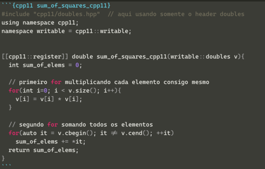

```{r setup, include=FALSE}
library(dplyr)
library(cpp11)
knitr::opts_chunk$set(echo = TRUE,
                      fig.align = "center")
get_reverse_deps <- function(package) {
  length(crandep::get_dep(package, "Reverse_linking_to"))
}
get_downloads <- function(package = "cpp11") {
  cranlogs::cran_downloads(package = package, from = "2016-01-01", to = "2020-12-31") %>%
    pull(count) %>%
    sum()
}
```

<!--Academicons Icons-->
<link rel="stylesheet" href="https://cdn.jsdelivr.net/gh/jpswalsh/academicons@1/css/academicons.min.css">

O [`{cpp11}`](https://cpp11.r-lib.org) é uma nova interface entre R e C++ desenvolvida pela equipe do RStudio.

Ainda é muito nova com apenas `r get_reverse_deps("cpp11")` links reversos de pacotes do CRAN, e com um total de `r format(get_downloads("cpp11"), big.mark = ".", decimal.mark = ",")` downloads (de 01/01/2016 à 31/12/2020).

## Principais Motivações do `{cpp11}`

As mudanças que motivaram `{cpp11}` incluem:

- Aplicação da [semântica de cópia na gravação (*copy-on-write semantics*)](https://cpp11.r-lib.org/articles/motivations.html#copy-on-write-semantics).
- Melhorar a [segurança](https://cpp11.r-lib.org/articles/motivations.html#improve-safety) de usar a API R a partir do código C++.
- Suporte a [objetos `ALTREP`](https://cpp11.r-lib.org/articles/motivations.html#altrep-support).
- Padrão de [strings `UTF-8`](https://cpp11.r-lib.org/articles/motivations.html#utf-8-everywhere)^[o `{Rcpp}` também tem suporte nativo a strings `UTF-8`.] em todos os lugares.
- Aplicação de [recursos e funcionalidades C++11 STL](https://cpp11.r-lib.org/articles/motivations.html#c11-features) mais novos.
- Ter uma [implementação mais simples](https://cpp11.r-lib.org/articles/motivations.html#simpler-implementation)e mais direta.
- [tempo de compilação mais rápido](https://cpp11.r-lib.org/articles/motivations.html#compilation-speed) com requisitos de memória mais baixos.
- Ser *completamente* [baseada em header (*header-only*)](https://cpp11.r-lib.org/articles/motivations.html#header-only).
- Capaz de [*vendoring*](https://cpp11.r-lib.org/articles/motivations.html#vendoring), se desejado.
- Mais robusta [proteção] (https://cpp11.r-lib.org/articles/motivations.html#protection) usando uma estrutura de dados de lista vinculada (*linked list*) muito mais eficiente.
- [Crescimento de vetores](https://cpp11.r-lib.org/articles/motivations.html#growing-vectors) de forma mais eficiente.

## Como usar `{cpp11}` no seu código C++

A sistemática é bem similar ao `{Rcpp}` e bem simples também. **Primeiro**, instale o pacote `{cpp11}` no R.

**Segundo**, includa no começo de todos seus arquivos `.cpp` e códigos C++:

```cpp
#include <cpp11.hpp>
using namespace cpp11;
namespace writable = cpp11::writable;
```

**Terceiro**, para cada função que desejar ser exportada de volta ao ambiente de R, inclua o seguinte prefixo antes da definição da função:

```cpp
[[cpp11::register]] ReturnType functionName(){return x;}
```

## Tipos de Dados -- `{Rcpp}` vs `{cpp11}`

O `{cpp11}` possui os mesmos tipos de dados que o `{Rcpp}`, mas ele permite um melhor controle pois conseguimos especificar o que é somente leitura e o que é "gravável" (`writable`). Além disso os headers são bem organizados e você não precisa trazer uma tralha toda que nem no `{Rcpp}`. Caso queira usar apenas strings use o header `<cpp11/strings.hpp>`. Abaixo uma tabela de referência de `{Rcpp}` vs `{cpp11}`.

```{r table-cpp11, echo=FALSE}
library(gt)
tibble::tribble(
                      ~Rcpp, ~`cpp11 (somente leitura)`,  ~`cpp11 ("gravável")`,                  ~`cpp11 header`,
            "NumericVector",            "doubles",  "writable::doubles",          "<cpp11/doubles.hpp>",
            "IntegerVector",           "integers", "writable::integers",         "<cpp11/integers.hpp>",
          "CharacterVector",            "strings",  "writable::strings",          "<cpp11/strings.hpp>",
                "RawVector",               "raws",     "writable::raws",             "<cpp11/raws.hpp>",
                     "List",               "list",     "writable::list",             "<cpp11/list.hpp>",
                  "RObject",               "sexp",                   NA,             "<cpp11/sexp.hpp>",
                     "XPtr",                   NA,   "external_pointer", "<cpp11/external_pointer.hpp>",
              "Environment",                   NA,        "environment",      "<cpp11/environment.hpp>",
                 "Function",                   NA,           "function",         "<cpp11/function.hpp>",
  "Environment (namespace)",                   NA,            "package",         "<cpp11/function.hpp>",
                     "wrap",                   NA,            "as_sexp",               "<cpp11/as.hpp>",
                       "as",                   NA,             "as_cpp",               "<cpp11/as.hpp>",
                     "stop",               "stop",                   NA,          "<cpp11/protect.hpp>"
  ) %>%
  mutate_all(tidyr::replace_na, "-") %>%
  mutate_all(~stringr::str_glue("`{.}`")) %>%
  gt() %>%
  fmt_markdown(everything())
```

Além disso, na tabela abaixo é possível ver a comparação entre as escalares de R vs `{cpp11}`:

```{r table-scalar-cpp11, echo=FALSE}
tibble::tribble(
           ~R,     ~cpp11,
    "numeric",   "double",
    "integer",      "int",
  "character", "r_string",
    "logical",     "bool"
  ) %>%
  mutate_all(~stringr::str_glue("`{.}`")) %>%
  gt() %>%
  fmt_markdown(everything())
```

## Como exportar funções `{cpp11}` para o ambiente R

`{cpp11}` funciona quase que de maneira idêntica que o `{Rcpp}`, apenas a nomenclatura muda. `{Rcpp}` usa `camelCase` e `{cpp11}` usa `snake_case`. Veja abaixo ma tabela comparativa:

```{r table-fun-cpp11, echo=FALSE}
tibble::tribble(
           ~Rcpp,     ~cpp11,
    "cppFunction()",   "cpp_function()",
    "sourceCpp()",     "cpp_source()"
) %>%
  mutate_all(~stringr::str_glue("`{.}`")) %>%
  gt() %>%
  fmt_markdown(everything())

```


## Exemplo -- Soma dos Quadrados

Vamos reutilizar o exemplo `sum_of_squares` do [tutorial 2. Como incorporar C++ no R - {Rcpp}](2-Rcpp.html).

Soma dos quadrados é algo que ocorre bastante em computação científica, especialmente quando estamos falando de regressão, mínimos quadrados, ANOVA etc. Vamos comparar a função usando um [`std::acummulate`](https://en.cppreference.com/w/cpp/algorithm/accumulate) de C+11 STL^[`{cpp11}` ainda não possui suporte à funcionalidades de C++20 -- `std::transform_reduce()`.] tanto no `{Rcpp}` quanto no `{cpp11}`. Lembrando que esta implementação será uma função que aceita como parâmetro um vetor de números reais (C++ `double` / R `numeric`) e computa a soma de todos os elementos do vetor elevados ao quadrado.

Para ser uma comparação justa, vamos usar também do [tutorial 2. Como incorporar C++ no R - {Rcpp}](2-Rcpp.html), a função `sum_of_squares_rcpp_sugar()` que usa [`{Rcpp}` Sugar](http://dirk.eddelbuettel.com/code/rcpp/Rcpp-sugar.pdf).

```{Rcpp sum_of_squares_rcpp}
#include <Rcpp.h>
#include <numeric>

using namespace Rcpp;

// [[Rcpp::plugins("cpp11")]]

// [[Rcpp::export]]
double sum_of_squares_rcpp(NumericVector v){
  double sum_of_elems = 0;

  sum_of_elems += std::accumulate(v.cbegin(),
                                  v.cend(),
                                  0.0,
                                  [] (double i, double j) {return i + (j * j);});
  return sum_of_elems;
}

// [[Rcpp::export]]
double sum_of_squares_rcpp_sugar(NumericVector v){
  return(sum(v*v));
}
```


```{cpp11 sum_of_squares_cpp11}
#include "cpp11/doubles.hpp"  // aqui usando somente o header doubles
#include <numeric>

using namespace cpp11;
namespace writable = cpp11::writable;


[[cpp11::register]] double sum_of_squares_cpp11(doubles v){
  double sum_of_elems = 0;

  sum_of_elems += std::accumulate(v.cbegin(),
                                  v.cend(),
                                  0.0,
                                  [] (double i, double j) {return i + (j * j);});
  return sum_of_elems;
}

```

```{r bench-sum_of_squares}
set.seed(123)
b1 <- bench::press(
  n = 10^c(4:6),
  {
    v = rnorm(n)
    bench::mark(
      Rcpp = sum_of_squares_rcpp(v),
      cpp11 = sum_of_squares_cpp11(v),
      Rcppsugar = sum_of_squares_rcpp_sugar(v),
      check = FALSE,
      relative = TRUE
)
  })
b1
```

```{r figsumofsquars, echo=FALSE, fig.cap='Benchmarks de Soma dos Quadrados: `Rcpp` vs `cpp11`'}
ggplot2::autoplot(b1, "violin")
```

Quando usada a biblioteca padrão C++11 STL tanto `{cpp11}` quanto `{Rcpp}` e `{Rcpp}` Sugar, pelo menos neste simples benchmark e no meu computador, possuem um desempenho similar para um vetor com `r format(n, big.mark = ".", decimal.mark = ",")` elementos. É claro que solução do `{Rcpp}` Sugar é muito mais elegante e simples com uma única linha na função.

## `{cpp11}` e Rmarkdown

Na mesma lógica de `{Rcpp}`, para usar o `{cpp11}` em documentos rmarkdown basta colocar `cpp11` no chunk ao invés de `r`. Além disso é necessário instalar o pacote `{decor}`. Não esqueça de chamar um `library(cpp11)` no arquivo rmarkdown.

```{r cpp11-rmarkdown, echo=FALSE, fig.cap='`{cpp11}` no Rmarkdown'}

```

## Usar `{cpp11}` no seu pacote R

Para adicionar `{cpp11}` a um pacote existente, coloque seus arquivos C++ no diretório `src/` e adicione no arquivo `DESCRIPTION`:

```
LinkingTo: cpp11
```

A maneira mais fácil de configurar isso automaticamente é chamar [`usethis::use_cpp11()`](https://usethis.r-lib.org/reference/use_cpp11.html) do pacote `{usethis}`.

Antes de construir o pacote, você precisará executar `cpp11::cpp_register()`. Esta função verifica os arquivos C++ em busca de atributos `[[cpp11::register]]` e gera o código de ligação necessário para disponibilizar as funções em R. Execute novamente `cpp11::cpp_register()` sempre que as funções forem adicionadas, removidas ou seus nomes forem alterados. Se você estiver usando `{devtools}` para desenvolver seu pacote, isso é feito automaticamente pelo pacote `{pkgbuild}` quando seu pacote tem `LinkingTo: cpp11` em seu arquivo `DESCRIPTION`.

## Ambiente

```{r SessionInfo}
sessionInfo()
```

